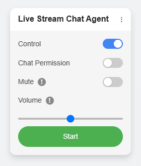

# Live Stream Chat AI Agent

An AI-powered agent designed to watch live streams, understand the content (audio, chat, video), and participate in the chat automatically using a Large Language Model (LLM).

## Overview

This project enables an AI to act as a viewer in live streams. It captures stream data, sends it to a backend for processing by an LLM (like GPT models), and uses the AI's response to interact with the chat.

It consists of two main parts:

1.  **Frontend Userscript:** Runs in your browser (via Tampermonkey/Violentmonkey) on live stream pages. It captures audio, chat messages, and screenshots, displays a control panel, and communicates with the backend.
2.  **Backend Server:** A Python Flask server that receives data, performs Speech-to-Text (STT), optionally uploads screenshots, interacts with an LLM, manages conversation memory, and sends back generated chat messages.

## Key Features

*   **Automated Chat Interaction:** Sends AI-generated messages based on stream content.
*   **Multimodal Context:** Processes live audio, chat history, and screenshots (optional).
*   **LLM Integration:** Leverages powerful LLMs (OpenAI-compatible APIs).
*   **Customizable AI Persona:** Define the agent's behavior via a system prompt.
*   **Persistent Memory:** Maintains per-stream conversation history and a notepad.
*   **Multiple STT Options:** Supports Whisper (via LLM API) and Youdao ASR.
*   **Vision Support (Optional):** Uploads screenshots to Cloudinary for analysis by vision LLMs.
*   **User Control Panel:** In-page UI to Start/Stop, manage chat permissions, and adjust local volume/mute.

## Platform Support

*   **Currently Supported:**
    *   Bilibili Live (`live.bilibili.com`)
*   **Planned Future Support:**
    *   YouTube Live
    *   Twitch
    *   Facebook Live
    *   Other popular platforms (contributions welcome!)

## Technologies

*   **Frontend:** JavaScript (ES6+), Web Audio API, MediaRecorder API, Canvas API, DOM Manipulation
*   **Backend:** Python 3, Flask, Requests, OpenAI Python Library, Pillow, Cloudinary Python SDK (optional), python-dotenv, Tiktoken
*   **AI Services:** OpenAI-compatible LLM API, Youdao ASR API (optional), Whisper (optional)
*   **Userscript Manager:** Tampermonkey or Violentmonkey

## Requirements

*   Modern Web Browser (Chrome, Firefox, Edge)
*   Tampermonkey or Violentmonkey browser extension
*   Python 3.8+
*   `pip` package installer
*   `ffmpeg` installed and in system PATH (or path specified in `.env`)
*   API Keys:
    *   LLM API Key & URL (**Required**)
    *   Youdao App Key & Secret (If using Youdao STT)
    *   Cloudinary Credentials (If using Cloudinary vision uploads)

## Quick Start

1.  **Backend Setup:** Clone repo, install Python dependencies (`pip install -r requirements.txt`), configure API keys in `.env` (copy from `.env.example`), run `python server.py`. (See [**Backend Setup**](docs/TUTORIAL.md#backend-server-setup))
2.  **Frontend Setup:** Install Tampermonkey/Violentmonkey, install the `.user.js` script, ensure `API_ENDPOINT` in the script matches your backend address. (See [**Frontend Setup**](docs/TUTORIAL.md#frontend-userscript-setup))
3.  **Usage:** Go to a supported live stream, use the control panel to start the agent. (See [**Usage Guide**](docs/TUTORIAL.md#usage))

**➡️ For detailed steps, please read the [Full Tutorial (TUTORIAL.md)](docs/TUTORIAL.md)**

## Project Structure
